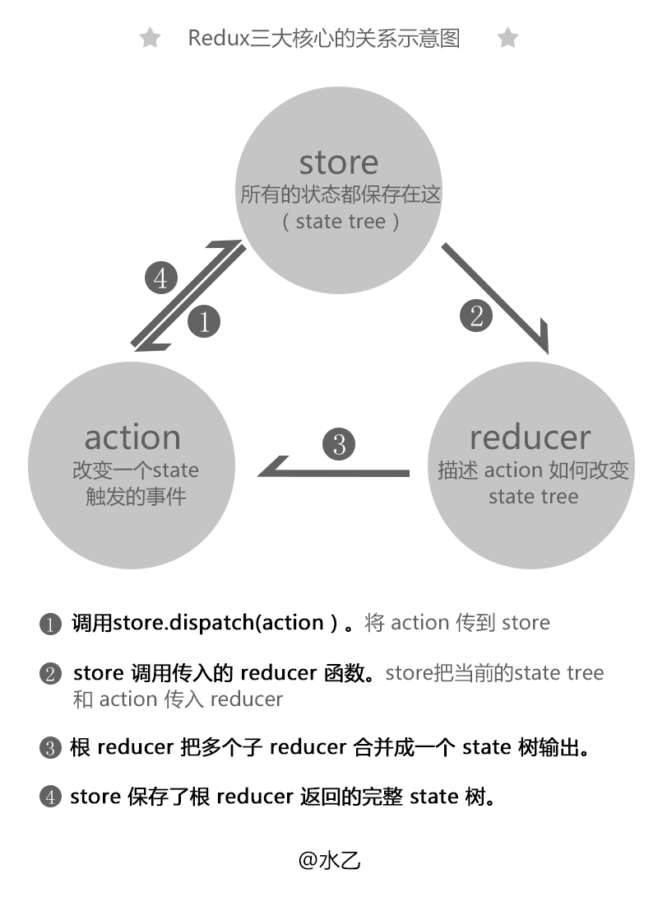

# redux总结
## 动机
	* 为了解决单页应用(SPA)的状态管理问题
## 实现

## 设计原则
	* 单一数据源
		* 整个应用的 state 被储存在一棵 object tree 中，并且这个 object tree 只存在于唯一一个 store 中
	* State 是只读的
		* 惟一改变 state 的方法就是触发 action，action 是一个用于描述已发生事件的普通对象。
	* 使用纯函数来执行修改
		* 为了描述 action 如何改变 state tree ，你需要编写 reducers。
## 基础知识
	* action
		* object
			* type
			* other
	* reducer
		* function
			* 参数
				* state
				* action
			* 返回值
				* state
## API
	* createStore(reducer, [initialState], enhancer)
		* 参数
			* 
		* 返回值
			* object
				* dispatch 触发action
			    * subscribe 订阅事件监听
			    * getState 获取当前状态
			    * replaceReducer 替换reducer
	* combineReducers(reducers)
		* 合并 reducer
	* bindActionCreators(actionCreators, dispatch)
		* 参数
			* 
		* 返回值
			* 
	* applyMiddleware(...middlewares)
		* 参数
			* 
		* 返回值 
			* 
	* compose(...functions)
		* 参数
			* 
		* 返回值
			* 
## 异步类库
	* redux-saga
	* redux-thunk
## 不同view库的实现
	